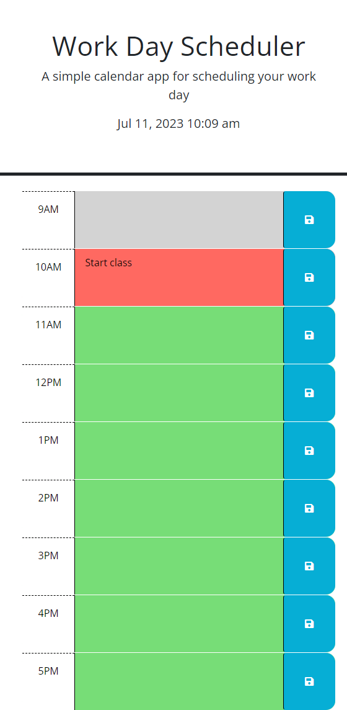

# Work_Day_Scheduler
A simple calendar application that allows a user to save events for each hour of a typical working day (9am–5pm)

## Description

Work Day Scheduler webpage was created for UCF bootcamp class as a webpage to create and keep track of a schedule for the work day. The webpage takes input of tasks for different times and saves them, while also displaying an accurate time. The webpage was designed to go along with learning and display student ability to utilize knowledge on JavaScript and APIs.

## Installation

N/A

## Usage

To use the Work Day Scheduler page, load webpage and view the time. Type a task in a space next to a specific time and click the save button to save it to the page. Once saved, the typed in value will show on the page whenever loaded until it is changed.

The colors on each time block help show the task associated with the current time. The time in red is the current hour, the times in grey are the past hours, and the times in green are the future hours.

Link to the webpage: [Work Day Scheduler](https://sienkc.github.io/Work_Day_Scheduler/)

Screenshot with generated random password:

## Credits

Majority of content provided by the boot camp creators [UCF Boot Camps](https://bootcamp.ce.ucf.edu/).

## License

Licensed under [MIT](LICENSE)
